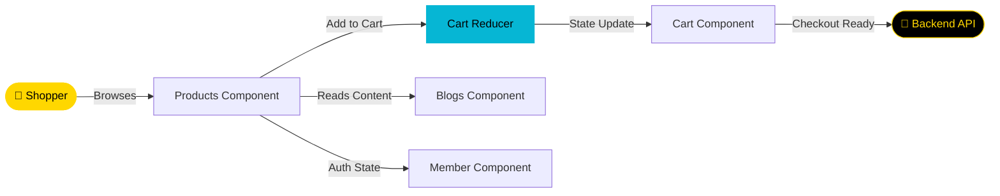

<div align="center">


[](https://git.io/typing-svg)

<br/>

<p align="center">
  <a href="https://github.com/NietoDeveloper">
    
  </a>
  <a href="https://committers.top/colombia#NietoDeveloper">
    
  </a>
  <a href="https://react.dev/">
    
  </a>
  <a href="https://vitejs.dev/">
    
  </a>
  <a href="https://tailwindcss.com/">
    
  </a>
  <a href="https://opensource.org/licenses/MIT">
    
  </a>
</p>

<p align="center">
  <a href="https://github.com/NietoDeveloper/Client-CannOil_1.1">
    
  </a>
</p>

</div>

---

## 📋 Overview

The frontend for **Cannoil E-Commerce** — a model online store for health products. Built by **Manuel Nieto**, Software Developer, in 2024, this client-side application showcases a modern, responsive UI. This build was selected by the client as the base to develop, and is designed to connect to an independent backend API repository.

---

## 🗂️ Project Structure

```text
Client-CannOil_1.1/
├── public/
└── src/
    ├── assets/
    │   ├── banner/
    │   ├── hero/
    │   ├── top/
    │   ├── website/
    │   └── women/
    ├── components/
    │   ├── Blogs/
    │   ├── Cart/
    │   ├── Layouts/
    │   ├── Member/
    │   └── Products/
    └── reducers/
```

---

## 🔄 Storefront Data Flow



---

## 🛠️ Technologies

<div align="center">

| Category | Technologies |
|:---------|:-------------|
| 🏃 **Runtime** | Node.js (runtime for development tools) |
| 🎨 **Frontend Library** | React (dynamic UI) |
| 💅 **Styling Framework** | Tailwind CSS (utility-first CSS) |
| ⚡ **Build Tooling** | Vite (fast frontend build tool) |

</div>

---

## ✨ Features

- **Responsive and Modern UI:** Clean, mobile-first interface across all viewports.
- **Product Catalog Display:** Structured product browsing experience.
- **Shopping Cart Integration:** State-managed cart via reducers.
- **Smooth User Interactions:** Fluid navigation between catalog, blog, and member sections.

---

## 🚀 Installation

**Step 1 — Clone the repository**

```bash
git clone https://github.com/NietoDeveloper/Client-CannOil_1.1
```

**Step 2 — Navigate to the client directory**

```bash
cd Cannoil-Ejemplo1/client
```

**Step 3 — Install dependencies**

```bash
npm install
```

**Step 4 — Start the development server**

```bash
npm run dev
```

---

## 📖 Usage

- Visit `http://localhost:5173` in your browser.
- Browse products and test the cart functionality.

---

## 🤝 Contributing

Fork the repo and submit pull requests for contributions.

---

## 📄 License

This project is licensed under the **MIT License**.

---

## 👨‍💻 Author

Developed by **Manuel Nieto (NietoDeveloper)**. Connect via [GitHub](https://github.com/NietoDeveloper).

<div align="center">

<br/>


</div>
